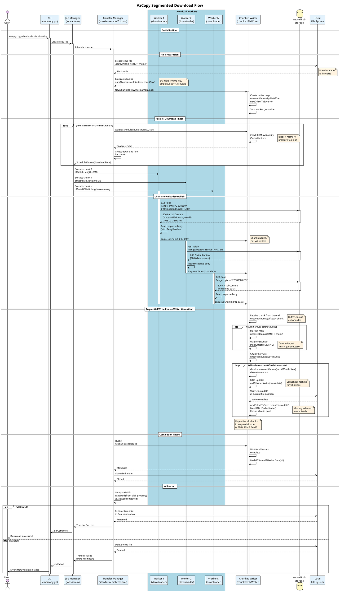

# Segmented Download Design in AzCopy

## Overview

This document details AzCopy's segmented download architecture, including constraints, splitting strategies, validation mechanisms, and applicability to regular HTTP downloads.

---

## Table of Contents
1. [Constraints for Segment Download](#constraints-for-segment-download)
2. [Segment Splitting Strategy](#segment-splitting-strategy)
3. [Download and Merge Strategy](#download-and-merge-strategy)
4. [Validation and Hash Calculation](#validation-and-hash-calculation)
5. [Regular HTTP File Support](#regular-http-file-support)
6. [Sequence Diagram](#sequence-diagram)
7. [Code References](#code-references)

---

## Constraints for Segment Download

### 1. File Size Requirements
- **Minimum Size:** Files must be > 0 bytes to trigger segmented download
- **Zero-byte Files:** Bypass chunking entirely (see `xfer-remoteToLocal-file.go:193-214`)
- **Chunk Size:** Configurable via `--block-size-mb` flag (default: 8 MB for downloads)
- **Calculation:** `numChunks = ceil(fileSize / downloadChunkSize)`

### 2. Memory Constraints
```go
// Source: chunkedFileWriter.go
const maxDesirableActiveChunks = 20  // Recommended max per file
```

**RAM Management:**
- Uses `CacheLimiter` to track scheduled-but-unsaved bytes in memory
- Prevents excessive memory consumption by limiting concurrent in-flight chunks
- Buffered channel size: `min(numChunks, 1000)` to balance performance and memory
- Chunks must wait for RAM availability via `WaitToScheduleChunk()`

**Memory Pressure Handling:**
```go
// chunkedFileWriter.go:141-150
func (w *chunkedFileWriter) WaitToScheduleChunk(ctx, id, chunkSize) error {
    // Block until enough RAM is available
    err := w.cacheLimiter.WaitUntilAdd(ctx, chunkSize, w.shouldUseRelaxedRamThreshold)
    // Reserve memory for this chunk
    atomic.AddInt64(&w.currentReservedCapacity, chunkSize)
}
```

### 3. Sequential Write Requirement
AzCopy **must** write chunks sequentially to the output file for two critical reasons:

1. **MD5 Hash Computation:** Hashing requires processing data in sequential order
2. **Performance Optimization:** Avoids need for privileged OS calls like Windows' `SetFileValidData`

**Implementation:**
- Chunks arrive in parallel but are buffered in a map: `unsavedChunksByFileOffset[offset] = chunk`
- Worker routine writes only contiguous chunks starting from `nextOffsetToSave`
- Out-of-order chunks wait in memory until predecessors arrive

---

## Segment Splitting Strategy

### Algorithm
Source: `xfer-remoteToLocal-file.go:269-333`

```go
// Calculate number of chunks
numChunks := uint32(0)
if rem := fileSize % downloadChunkSize; rem == 0 {
    numChunks = uint32(fileSize / downloadChunkSize)
} else {
    numChunks = uint32(fileSize/downloadChunkSize + 1)
}

// Split file into segments
for startIndex := int64(0); startIndex < fileSize; startIndex += downloadChunkSize {
    adjustedChunkSize := downloadChunkSize

    // Compute exact size of the chunk (last chunk may be smaller)
    if startIndex+downloadChunkSize > fileSize {
        adjustedChunkSize = fileSize - startIndex
    }

    // Create chunk identifier with offset and length
    id := common.NewChunkID(info.Destination, startIndex, adjustedChunkSize)

    // Wait for RAM availability
    dstWriter.WaitToScheduleChunk(jptm.Context(), id, adjustedChunkSize)

    // Generate download function for this chunk
    downloadFunc := dl.GenerateDownloadFunc(jptm, dstWriter, id, adjustedChunkSize, pacer)

    // Schedule the download chunk job
    jptm.ScheduleChunks(downloadFunc)
}
```

### Chunk Identification
```go
// common/chunkStatusLogger.go:34-44
type ChunkID struct {
    Name         string   // Destination file path
    offsetInFile int64    // Starting byte offset
    length       int64    // Number of bytes in this chunk
    waitReasonIndex *int32 // Shared pointer for status tracking
}
```

### Key Characteristics
- **Fixed-size chunks** (except last chunk which may be smaller)
- Each chunk identified by: `{fileName, offsetInFile, length}`
- Chunks scheduled for **parallel download** via worker pool
- All chunks must be scheduled (even after failures) to trigger epilogue

---

## Download and Merge Strategy

### Architecture: Single Output Stream with Range-Based Writing

**Yes, AzCopy uses ONE output stream** and writes downloaded chunks using their offset positions.

### Flow Overview

```
┌─────────────────────────────────────────────────────────────┐
│ 1. File Pre-allocation                                      │
│    - Create file with full target size                      │
│    - Use temp name: .azDownload-<jobID>-<actualName>        │
└────────────────────────┬────────────────────────────────────┘
                         │
                         ▼
┌─────────────────────────────────────────────────────────────┐
│ 2. Parallel Downloads (N Worker Goroutines)                 │
│    Worker 1: Download bytes [0, 8MB)                        │
│    Worker 2: Download bytes [8MB, 16MB)                     │
│    Worker 3: Download bytes [16MB, 24MB)                    │
│    ...                                                       │
│    Each uses HTTP Range header: Range: bytes=offset-end     │
└────────────────────────┬────────────────────────────────────┘
                         │
                         ▼
┌─────────────────────────────────────────────────────────────┐
│ 3. Buffered Channel (unordered chunks)                      │
│    newUnorderedChunks <- fileChunk{id, data}                │
└────────────────────────┬────────────────────────────────────┘
                         │
                         ▼
┌─────────────────────────────────────────────────────────────┐
│ 4. Sequential Writer (Single Worker Goroutine)              │
│    - Maintains: unsavedChunksByFileOffset map                │
│    - Tracks: nextOffsetToSave                                │
│    - Writes chunks in order: 0, 8MB, 16MB, 24MB...          │
│    - Computes MD5 hash as writing                            │
└────────────────────────┬────────────────────────────────────┘
                         │
                         ▼
┌─────────────────────────────────────────────────────────────┐
│ 5. Completion                                                │
│    - Flush all chunks                                        │
│    - Close file handle                                       │
│    - Validate MD5 hash                                       │
│    - Rename temp file to final name                          │
└─────────────────────────────────────────────────────────────┘
```

### Detailed Implementation

#### 1. File Creation (xfer-remoteToLocal-file.go:243-249)
```go
// Pre-allocate file to full size
dstFile, err := common.CreateFileOfSizeWithWriteThroughOption(
    destination,
    fileSize,  // Pre-allocate to avoid resizing
    writeThrough,
    jptm.GetFolderCreationTracker(),
    jptm.GetForceIfReadOnly()
)
```

**Temporary File Naming:**
```go
// xfer-remoteToLocal-file.go:572-585
func (info *TransferInfo) getDownloadPath() string {
    // Default: download to temp path
    downloadToTempPath := true

    if downloadToTempPath && info.SourceSize > 0 {
        parent, fileName := filepath.Split(info.Destination)
        fileName = fmt.Sprintf(".azDownload-%s-", info.JobID.String()) + fileName
        return filepath.Join(parent, fileName)
    }
    return info.Destination
}
```

#### 2. Parallel Range Download (downloader-blob.go:133-203)
```go
func (bd *blobDownloader) GenerateDownloadFunc(..., id ChunkID, length int64, ...) chunkFunc {
    return createDownloadChunkFunc(jptm, id, func() {

        // Control rate (for page blobs with per-blob limits)
        bd.filePacer.RequestTrafficAllocation(jptm.Context(), length)

        // Download specific byte range from blob
        get, err := bd.source.DownloadStream(enrichedContext, &blob.DownloadStreamOptions{
            Range: blob.HTTPRange{
                Offset: id.OffsetInFile(),  // Start byte
                Count:  length,              // Number of bytes
            },
            AccessConditions: accessConditions,  // If-Unmodified-Since check
            CPKInfo:          jptm.CpkInfo(),
            CPKScopeInfo:     jptm.CpkScopeInfo(),
        })

        // Create retry reader for body download
        retryReader := get.NewRetryReader(enrichedContext, &blob.RetryReaderOptions{
            MaxRetries:   int32(destWriter.MaxRetryPerDownloadBody()),
            OnFailedRead: common.NewBlobReadLogFunc(jptm, jptm.Info().Source),
        })
        defer retryReader.Close()

        // Enqueue chunk for sequential writing
        err = destWriter.EnqueueChunk(jptm.Context(), id, length, retryReader, true)
    })
}
```

**Key Points:**
- **HTTP Range Request:** `Range: bytes=<offset>-<offset+length-1>`
- **Access Conditions:** `If-Unmodified-Since` prevents downloading modified files
- **Retry Logic:** Transparent retries on network failures via `RetryReader`
- **Pacing:** Rate limiting for page blobs with throughput constraints

#### 3. Sequential Writing with Reordering (chunkedFileWriter.go:248-379)

**Worker Routine:**
```go
func (w *chunkedFileWriter) workerRoutine(ctx context.Context) {
    nextOffsetToSave := int64(0)
    unsavedChunksByFileOffset := make(map[int64]fileChunk)
    md5Hasher := md5.New()

    for {
        // Receive new chunk from parallel downloaders
        newChunk := <-w.newUnorderedChunks

        // Index the chunk by its offset
        unsavedChunksByFileOffset[newChunk.id.OffsetInFile()] = newChunk

        // Process all sequential chunks that are now available
        for {
            // Look for next chunk in sequence
            nextChunkInSequence, exists := unsavedChunksByFileOffset[nextOffsetToSave]
            if !exists {
                break  // Not arrived yet, wait for more chunks
            }

            // Remove from map and update offset
            delete(unsavedChunksByFileOffset, nextOffsetToSave)
            nextOffsetToSave += int64(len(nextChunkInSequence.data))

            // Write to disk and hash
            saveOneChunk(nextChunkInSequence, md5Hasher)
        }
    }
}
```

**Single Chunk Write:**
```go
// chunkedFileWriter.go:350-379
func (w *chunkedFileWriter) saveOneChunk(chunk fileChunk, md5Hasher hash.Hash) error {
    const maxWriteSize = 1024 * 1024  // 1MB chunks for better perf

    // Write in 1MB sub-chunks (helps with Azure VM Storage Spaces)
    for i := 0; i < len(chunk.data); i += maxWriteSize {
        slice := chunk.data[i:min(i+maxWriteSize, len(chunk.data))]

        // Always hash exactly what we save
        md5Hasher.Write(slice)

        // Write to file (sequential writes only)
        _, err := w.file.Write(slice)
        if err != nil {
            return err
        }
    }

    // Free memory immediately
    w.cacheLimiter.Remove(int64(len(chunk.data)))
    w.slicePool.ReturnSlice(chunk.data)

    return nil
}
```

### Critical Implementation Details

1. **No Seek Operations:**
   - File is written sequentially from offset 0 onwards
   - No random access or seeking required
   - Chunks buffer in RAM until all predecessors arrive

2. **Memory Management:**
   - Chunks use byte slice pool to reduce GC pressure
   - Memory freed immediately after write
   - RAM throttling prevents scheduling too many chunks

3. **Page Blob Optimization:**
   ```go
   // downloader-blob.go:103, 137-146
   bd.pageRangeOptimizer.fetchPages()

   if !bd.pageRangeOptimizer.doesRangeContainData(pageRange) {
       // Skip downloading zero ranges, write zeros directly
       err := destWriter.EnqueueChunk(jptm.Context(), id, length, dummyReader{}, false)
   }
   ```

4. **Slow Chunk Detection:**
   - Monitor download progress per chunk
   - Force retry if chunk is slow AND later chunks arrived AND RAM is tight
   - Prevents stalls due to sequential write requirement

---

## Validation and Hash Calculation

### Overview
AzCopy employs a **whole-file MD5 validation** strategy rather than per-segment validation.

### Hash Sources

#### 1. Server-Side Hash (Preferred)
```go
// xfer-remoteToLocal-file.go:404
// The MD5 that came back from Service when we enumerated the source
expected := info.SrcHTTPHeaders.ContentMD5
```

**Blob Storage MD5:**
- Stored as blob property: `Content-MD5` header
- Set during upload or can be manually set via blob properties
- Represents hash of **entire blob content**
- Retrieved during enumeration phase, not during download

**Azure Files MD5:**
- Stored as file property
- Similar to blob storage

#### 2. Client-Side Hash Computation
```go
// chunkedFileWriter.go:251-255, 371-372
md5Hasher := md5.New()
// ...
// For each chunk written in sequence:
md5Hasher.Write(slice)  // Hash exactly what we save
```

**Sequential Hashing:**
- MD5 computed **during sequential write** phase
- NOT during parallel download phase
- Ensures hash matches actual file contents as written
- Computed incrementally as chunks are written in order

### Validation Process

#### Validation Options
```go
// common/fe-ste-models.go
type HashValidationOption uint8

const (
    NoCheck                    // Skip validation
    FailIfDifferent            // Fail only if hashes differ
    FailIfDifferentOrMissing   // Fail if no server hash or mismatch
    LogOnly                    // Log warnings but don't fail
)
```

#### Validation Flow
```go
// xfer-remoteToLocal-file.go:402-411
if jptm.IsLive() {
    comparison := md5Comparer{
        expected:         info.SrcHTTPHeaders.ContentMD5,  // From server
        actualAsSaved:    md5OfFileAsWritten,              // Client computed
        validationOption: jptm.MD5ValidationOption(),
        logger:           jptm
    }
    err := comparison.Check()
    if err != nil {
        jptm.FailActiveDownload("Checking MD5 hash", err)
    }
}
```

#### Validation Implementation (ste/md5Comparer.go:56-96)
```go
func (c *md5Comparer) Check() error {
    if c.validationOption == NoCheck {
        return nil
    }

    // Missing at source
    if len(c.expected) == 0 {
        switch c.validationOption {
        case FailIfDifferentOrMissing:
            return errExpectedMd5Missing
        case FailIfDifferent, LogOnly:
            c.logAsMissing()
            return nil
        }
    }

    // Compare hashes
    if !bytes.Equal(c.expected, c.actualAsSaved) {
        switch c.validationOption {
        case FailIfDifferentOrMissing, FailIfDifferent:
            return errMd5Mismatch
        case LogOnly:
            c.logAsDifferent()
            return nil
        }
    }

    return nil
}
```

### Per-Segment Hash Calculation (Optional)

While AzCopy doesn't validate per-segment during download, Azure Storage **can** provide segment-level MD5:

```go
// ste/sourceInfoProvider-Blob.go:171-192
func (p *blobSourceInfoProvider) GetMD5(offset, count int64) ([]byte, error) {
    var rangeGetContentMD5 *bool
    if count <= common.MaxRangeGetSize {  // 4MB for Azure
        rangeGetContentMD5 = to.Ptr(true)  // Request range MD5 from server
    }

    response, err := p.source.DownloadStream(p.ctx, &blob.DownloadStreamOptions{
        Range:              blob.HTTPRange{Offset: offset, Count: count},
        RangeGetContentMD5: rangeGetContentMD5,  // x-ms-range-get-content-md5 header
        CPKInfo:            p.jptm.CpkInfo(),
        CPKScopeInfo:       p.jptm.CpkScopeInfo(),
    })

    if len(response.ContentMD5) > 0 {
        return response.ContentMD5, nil  // Server computed range hash
    } else {
        // Fallback: compute MD5 client-side
        body := response.NewRetryReader(...)
        h := md5.New()
        io.Copy(h, body)
        return h.Sum(nil), nil
    }
}
```

**Range MD5 Limitations:**
- Azure Blob Storage: Max 4MB range for server-computed MD5
- Larger ranges: Client must compute hash
- Currently used for **uploads** (verify chunk integrity), not downloads

### Hash Merging: Why Not Supported

**AzCopy does NOT merge per-segment hashes** for several reasons:

1. **No Standard Algorithm:**
   - No universal standard for merging MD5 hashes from segments
   - Custom schemes would break compatibility with Azure Storage's stored MD5

2. **Sequential Hashing is Efficient:**
   - MD5 is computed during sequential disk writes
   - No additional I/O or computation overhead
   - Data already in memory during write

3. **Whole-File Hash is Stored:**
   - Azure Storage stores whole-file MD5 as blob property
   - Validation requires comparing against this whole-file hash
   - Per-segment validation wouldn't replace need for whole-file validation

4. **Alternative Solutions Exist:**
   - For multi-part uploads to S3, AWS provides `ETag` based on part hashes
   - Azure Blob Storage doesn't have equivalent mechanism
   - Custom hash schemes would be non-standard

**Theoretical Approaches to Hash Merging:**
- **Tree Hashing:** Used by Amazon Glacier (SHA256-based)
- **Composite ETag:** S3's multi-part upload ETag format
- **Hash Lists:** Store per-segment hashes separately

**Why AzCopy Doesn't Use These:**
- Azure Storage API returns single MD5 for entire blob
- No infrastructure to store/retrieve per-segment hashes
- Added complexity for marginal benefit (sequential hashing works well)

### Early Validation Check
```go
// xfer-remoteToLocal-file.go:107-116
if jptm.MD5ValidationOption() == FailIfDifferentOrMissing() {
    // Fail fast if MD5 is required but missing
    if len(info.SrcHTTPHeaders.ContentMD5) == 0 {
        jptm.LogDownloadError(info.Source, info.Destination,
            errExpectedMd5Missing.Error(), 0)
        jptm.SetStatus(ETransferStatus.Failed())
        jptm.ReportTransferDone()
        return
    }
}
```

**Benefits:**
- Fails early before downloading large files
- Saves hours for multi-GB files without stored MD5
- User gets immediate feedback

### Summary: Validation Strategy

| Aspect | Implementation |
|--------|---------------|
| **Server Hash** | Whole-file MD5 from blob `Content-MD5` property |
| **Client Hash** | Computed sequentially during disk writes |
| **Per-Segment Hash** | Available from server (≤4MB) but not used for validation |
| **Hash Merging** | Not supported (no standard algorithm) |
| **Validation Timing** | After all chunks downloaded and written |
| **Failure Handling** | Delete partial file, report transfer failed |

---

## Regular HTTP File Support

### Current Support: Azure Storage Only

AzCopy's segmented download is **specifically designed for Azure Storage services**:

```go
// common/fe-ste-models.go:706-740
// Supported download paths (FromTo combinations):
func (FromTo) BlobLocal() FromTo      // Azure Blob → Local
func (FromTo) FileLocal() FromTo      // Azure Files → Local
func (FromTo) BlobFSLocal() FromTo    // Azure Data Lake Gen2 → Local
func (FromTo) S3Blob() FromTo         // AWS S3 → Azure Blob (S2S only)
func (FromTo) GCPBlob() FromTo        // GCP → Azure Blob (S2S only)
```

**Notice:** No `HttpLocal()` or similar path exists.

### Why Regular HTTP is Not Supported

#### 1. Authentication Complexity
AzCopy's architecture assumes cloud storage authentication:
```go
// ste/downloader-blob.go:69-81
blobClient := s.NewContainerClient(jptm.Info().SrcContainer)
    .NewBlobClient(jptm.Info().SrcFilePath)

// Handles SAS tokens, OAuth, shared keys, etc.
```

**HTTP Requirements:**
- Different auth schemes (Basic, Bearer, API keys)
- No standardized credential model
- Would require major refactoring of credential system

#### 2. Missing Metadata APIs
Azure Storage provides rich metadata APIs:
```go
// Used during enumeration:
- Blob properties (size, MD5, last modified, ETag)
- Access tiers, encryption status
- Version IDs, snapshots
```

**HTTP Requirements:**
- `HEAD` request to get `Content-Length`
- `Content-MD5` header (optional, rarely set)
- No standard way to get blob-specific metadata

#### 3. Range Request Support Uncertainty
```go
// downloader-blob.go:178-183
Range: blob.HTTPRange{Offset: id.OffsetInFile(), Count: length}
```

**HTTP Requirements:**
- Server must support `Accept-Ranges: bytes`
- Server must honor `Range` headers correctly
- No guarantee generic HTTP server supports ranges

#### 4. Retry and Resilience Features
AzCopy uses Azure SDK's built-in retry policies:
```go
// downloader-blob.go:192-196
retryReader := get.NewRetryReader(enrichedContext, &blob.RetryReaderOptions{
    MaxRetries:   int32(destWriter.MaxRetryPerDownloadBody()),
    OnFailedRead: common.NewBlobReadLogFunc(jptm, jptm.Info().Source),
})
```

**HTTP Requirements:**
- Custom retry logic needed
- No built-in support for transient error detection
- Must handle various HTTP error codes (5xx, 429, etc.)

### What Would Be Needed for HTTP Support

#### Minimal Requirements:
1. **Range Support Detection:**
   ```http
   HEAD /file.bin HTTP/1.1

   HTTP/1.1 200 OK
   Accept-Ranges: bytes
   Content-Length: 1073741824
   ```

2. **Fallback for Non-Range Servers:**
   - Single-threaded download if no range support
   - Detect via `Accept-Ranges: none` or failed range request

3. **Generic Authentication:**
   - Support for common HTTP auth methods
   - Header-based API key injection
   - Configurable via CLI flags

4. **MD5 Validation:**
   - Parse `Content-MD5` header if present
   - Allow opt-out if not available
   - Compute client-side hash always

5. **Error Handling:**
   - Retry logic for HTTP 5xx errors
   - Handle rate limiting (HTTP 429)
   - Timeout management

#### Implementation Example (Conceptual):

```go
// Hypothetical: downloader-http.go
type httpDownloader struct {
    url           string
    client        *http.Client
    supportsRange bool
}

func (hd *httpDownloader) Prologue(jptm IJobPartTransferMgr) {
    // Detect range support
    resp, err := hd.client.Head(hd.url)
    hd.supportsRange = strings.Contains(resp.Header.Get("Accept-Ranges"), "bytes")

    if !hd.supportsRange {
        jptm.Log(LogWarning, "Server doesn't support range requests, using single-threaded download")
    }
}

func (hd *httpDownloader) GenerateDownloadFunc(...) chunkFunc {
    if !hd.supportsRange {
        // Fallback to single-chunk download
        return hd.generateSingleDownloadFunc(...)
    }

    return createDownloadChunkFunc(jptm, id, func() {
        req, _ := http.NewRequest("GET", hd.url, nil)
        req.Header.Set("Range", fmt.Sprintf("bytes=%d-%d",
            id.OffsetInFile(),
            id.OffsetInFile()+length-1))

        resp, err := hd.client.Do(req)
        if resp.StatusCode != http.StatusPartialContent {
            // Retry or fail
        }

        // Enqueue chunk
        destWriter.EnqueueChunk(ctx, id, length, resp.Body, false)
    })
}
```

### Limitations for Regular HTTP

| Feature | Azure Storage | Regular HTTP |
|---------|--------------|--------------|
| **Range Requests** | Guaranteed | Server-dependent |
| **Metadata** | Rich (MD5, ETag, etc.) | Limited (headers only) |
| **Retry Logic** | Built into SDK | Must implement |
| **Authentication** | Standardized (SAS, OAuth) | Varies (Basic, Bearer, API keys) |
| **Validation** | Blob property MD5 | `Content-MD5` header (rare) |
| **Version Control** | Snapshots, versions | Not standard |
| **Concurrent Safety** | ETag-based | ETag (if supported) |

### Workarounds for HTTP Downloads

1. **Use Standard Tools:**
   ```bash
   # For segmented HTTP downloads:
   aria2c -x 16 -s 16 https://example.com/file.bin
   curl --range 0-999999 https://example.com/file.bin
   ```

2. **Download to Local, Then Upload:**
   ```bash
   # Download with appropriate tool
   wget https://example.com/file.bin

   # Upload to Azure with AzCopy
   azcopy copy file.bin "https://account.blob.core.windows.net/container?SAS"
   ```

3. **Use Azure Import/Export:**
   - For very large HTTP sources
   - Download to local storage
   - Use Azure Import/Export service

### Summary: HTTP Support

| Aspect | Status |
|--------|--------|
| **Current Support** | ❌ Not implemented |
| **Segmented Download** | ❌ Would require significant changes |
| **Technical Feasibility** | ⚠️ Possible but not trivial |
| **Planned Support** | ℹ️ Not in current roadmap |
| **Recommendation** | Use specialized HTTP download tools |

---

## Sequence Diagram



### Diagram Key Points

1. **Parallel Download:** Multiple workers download different byte ranges simultaneously
2. **Buffering:** ChunkedFileWriter buffers out-of-order chunks in memory
3. **Sequential Write:** Single writer goroutine writes chunks in order (0, 8MB, 16MB...)
4. **MD5 Computation:** Hash computed during sequential write phase
5. **RAM Management:** Memory reserved before download, freed after write
6. **Validation:** Whole-file MD5 validated after all chunks written
7. **Atomicity:** Temp file renamed only after successful validation

---

## Code References

### Core Download Files
- **Transfer Orchestration:** `ste/xfer-remoteToLocal-file.go`
  - Line 52-340: Main download flow
  - Line 269-333: Chunk calculation and scheduling
  - Line 372-461: Epilogue and validation

- **Blob Downloader:** `ste/downloader-blob.go`
  - Line 133-203: Range download implementation
  - Line 178-183: HTTP range request setup

- **Chunked Writer:** `common/chunkedFileWriter.go`
  - Line 107-128: Constructor and initialization
  - Line 141-150: RAM scheduling
  - Line 153-203: Chunk enqueuing
  - Line 248-301: Sequential write worker
  - Line 350-379: Single chunk write

### Validation and Hashing
- **MD5 Comparer:** `ste/md5Comparer.go`
  - Line 33-96: Validation logic

- **Source Info Provider:** `ste/sourceInfoProvider-Blob.go`
  - Line 171-192: Per-range MD5 retrieval (for uploads)

### Configuration and Models
- **Transfer Models:** `common/fe-ste-models.go`
  - Line 702-752: FromTo combinations (supported paths)

- **Chunk ID:** `common/chunkStatusLogger.go`
  - Line 34-44: Chunk identifier structure

### Job Management
- **Job Part Manager:** `ste/mgr-JobPartMgr.go`
  - Worker pool and chunk scheduling

- **Job Admin:** `jobsAdmin/init.go`
  - Job lifecycle and concurrency management

---

## Summary

### Key Takeaways

1. **Single Output Stream:** AzCopy uses one file handle with sequential writes
2. **Range-Based Download:** HTTP Range headers enable parallel segment downloads
3. **In-Memory Reordering:** Out-of-order chunks buffer until predecessors arrive
4. **Whole-File Validation:** MD5 computed sequentially during writes, validated at end
5. **No Per-Segment Validation:** Azure Storage provides whole-file MD5, not per-segment
6. **Azure-Specific:** Designed for Azure Storage APIs, not generic HTTP

### Design Strengths

✅ **Memory Efficient:** RAM management prevents excessive memory consumption
✅ **Performance Optimized:** Parallel downloads with sequential writes
✅ **Resilient:** Automatic retries, slow chunk detection, crash recovery
✅ **Validated:** MD5 verification ensures data integrity
✅ **Scalable:** Handles files from bytes to terabytes

### Limitations

❌ **No HTTP Support:** Azure Storage only, no generic HTTP downloads
❌ **No Per-Segment Validation:** Can't detect corruption mid-download
❌ **Sequential Write Required:** Can't leverage parallel disk writes
❌ **No Hash Merging:** Must compute whole-file hash sequentially

### Applicability to HTTP Downloads

⚠️ **Not Currently Supported:** Would require significant architectural changes
⚠️ **Range Request Dependency:** HTTP servers must support byte ranges
⚠️ **Limited Metadata:** HTTP lacks Azure Storage's rich metadata APIs
⚠️ **Authentication Challenges:** No standardized HTTP auth like Azure SAS tokens

**Recommendation:** For HTTP downloads, use specialized tools like `aria2c`, `wget`, or `curl` with range support.

---

## References

- [Azure Blob Storage REST API - Get Blob](https://learn.microsoft.com/en-us/rest/api/storageservices/get-blob)
- [HTTP Range Requests (RFC 7233)](https://tools.ietf.org/html/rfc7233)
- [MD5 Message-Digest Algorithm (RFC 1321)](https://tools.ietf.org/html/rfc1321)
- [AzCopy Architecture Overview](./readme.md)

---

**Document Version:** 1.0
**Last Updated:** 2025-09-29
**Maintainer:** AzCopy Team